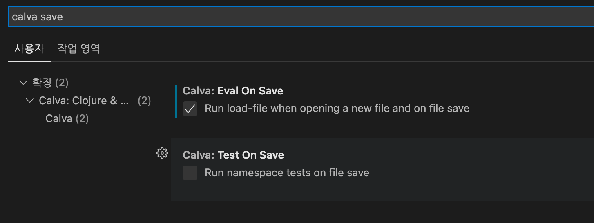
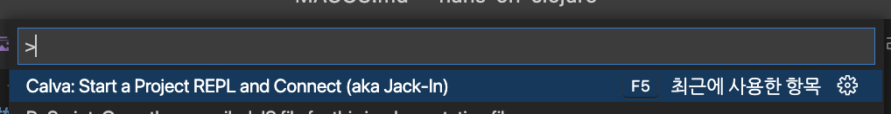
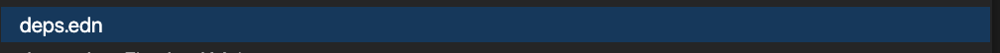
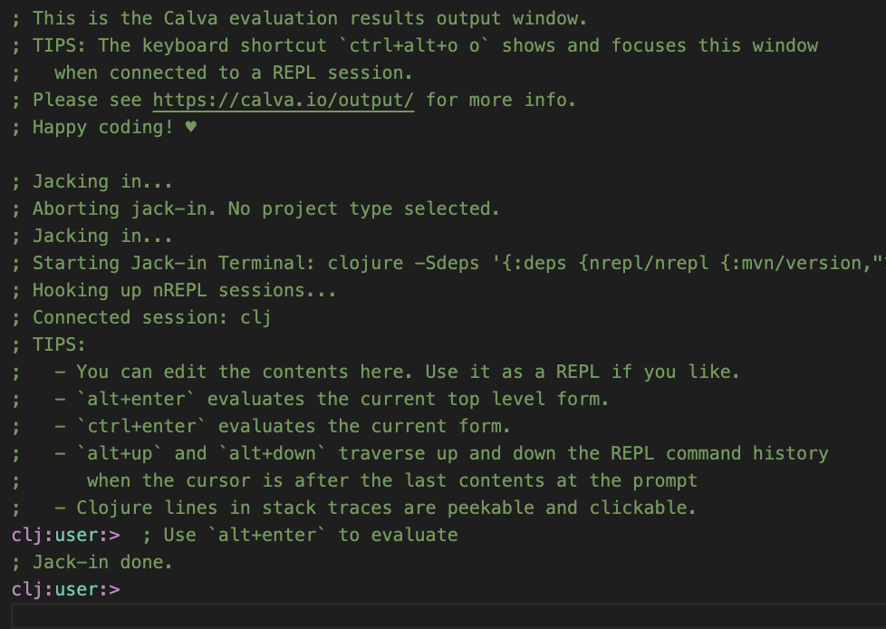

### JDK 설치 ###
- [JDK17 Corretto](https://aws.amazon.com/ko/corretto/?filtered-posts.sort-by=item.additionalFields.createdDate&filtered-posts.sort-order=desc)

### Clojure 설치 ###
```bash
brew install clojure/tools/clojure
```
### VSCODE 설치 ###
https://code.visualstudio.com/


### VSCODE 에서 Calva 플러그인 설치 ###
</img>
- 설정 바꾸기 ```cmd + ,``` 
- ```calva save``` 입력
</img>


### project 실행 ###
Command Palette 실행 ```cmd + shift + p```
</img>
</img>
</img>

### solution.clj 실행 ###
- ```solution.clj``` 로 들어가서
- evaluation ```cmd + s```
- 한 줄씩 evaluation ```alt + enter```