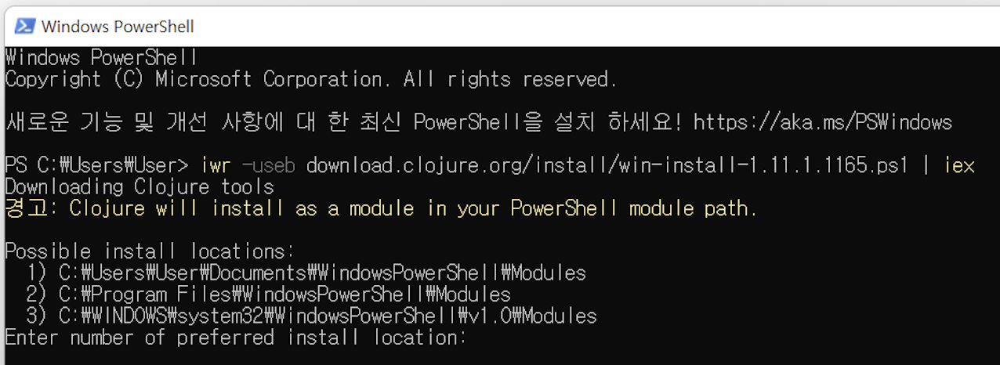
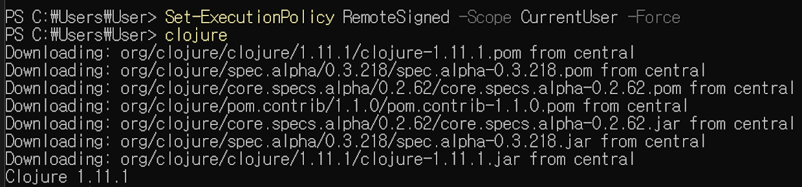
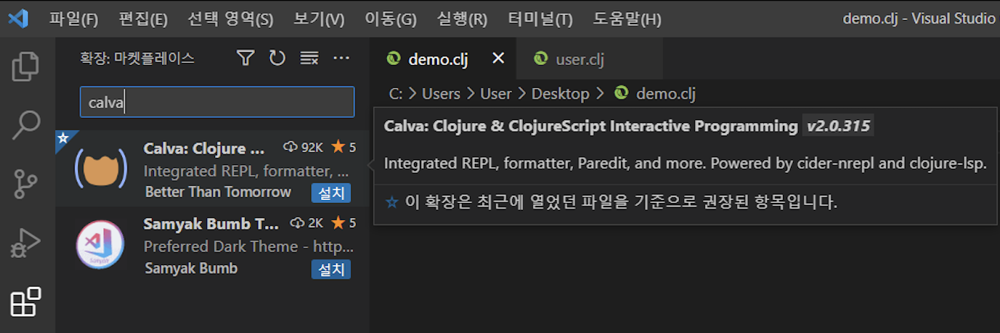
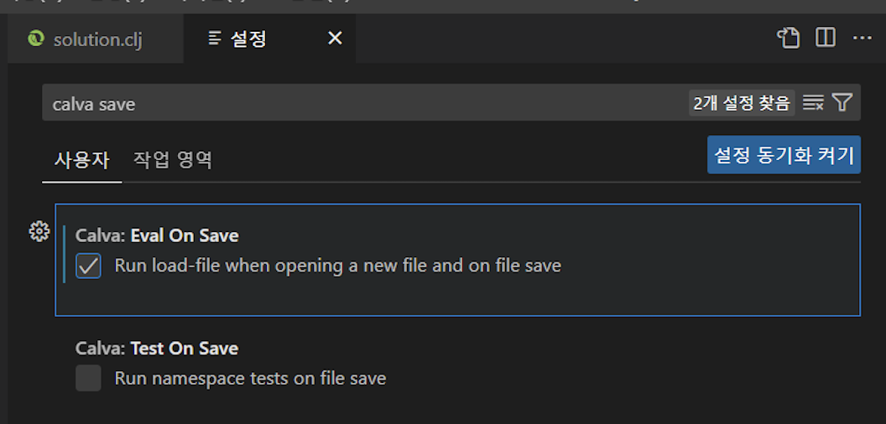
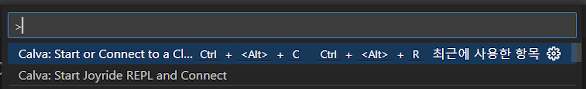
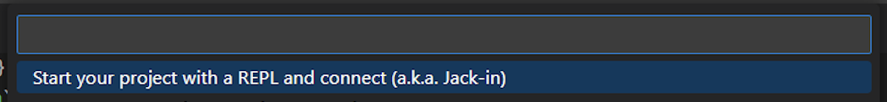
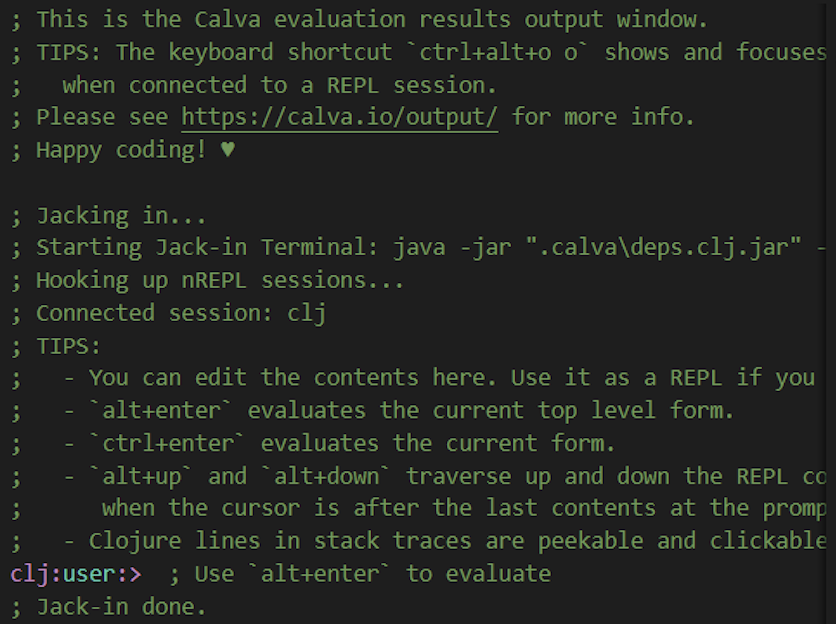

### JDK 설치 ###
- [JDK17 Corretto](https://corretto.aws/downloads/latest/amazon-corretto-17-x64-windows-jdk.msi)

### Clojure 설치 ###
- [download clojure](https://download.clojure.org/install/win-install-1.11.1.1165.ps1)
</img>
    - 1,2,3 중 하나를 입력해서 설치 경로 지정
- 실행 권한이 없을 경우 아래 명령어를 입력
```bash
Set-ExecutionPolicy RemoteSigned -Scope CurrentUser -Force
```
- ```clojure```를 입력했을 때 아래처럼 나오면 설치 성공
</img>

### VSCODE 설치 ###
https://code.visualstudio.com/


### VSCODE 에서 Calva 플러그인 설치 ###
</img>
- 설정 바꾸기 ```ctrl + ,```
- ```calva save``` 입력
</img>


### project 실행 ###
Command Palette 실행 ```cmd + shift + p```
</img>
</img>
</img>
</img>

### solution.clj 실행 ###
- ```solution.clj``` 로 들어가서
- 네임스페이스 로드(파일 저장시 자동으로 파일을 평가) ```ctrl + s```
- 커서가 위치한 곳의 식(form)을 평가 ```alt + enter```
